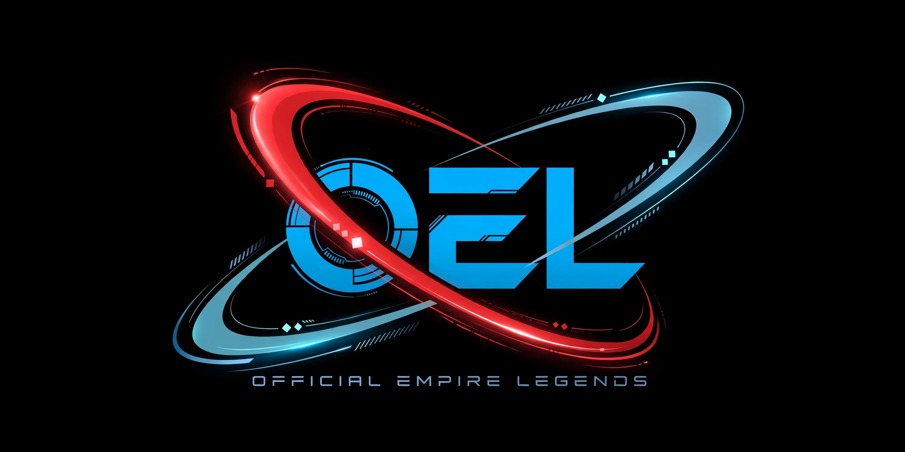

# OFFICIAL EMPIRE LEGENDS (OEL)

**Official Empire Legends (OEL)** is a technology and creative brand founded by **Michael M. Situmbeko — Macky Boy ØËL**, a Software Engineering student and developer from Zambia.

OEL represents a journey of **learning, building, creating, and evolving**, with a focus on practical digital solutions and emerging technologies.

**Building ideas into technology. Learning. Creating. Evolving.**

### 🚀 Live Website

https://situmbekomichael81-ops.github.io/official-empire-legends/

### 💻 What We Do

- 🌐 **Web Development** — Websites and digital solutions
- 📱 **Mobile App Development** — Mobile applications and experiences
- 💻 **Software Development** — Practical software solutions
- 🎨 **UI/UX & Graphic Design** — Interfaces and creative digital design
- 🗄️ **Database Development** — Data-driven applications
- 🤖 **AI & Computer Vision** — Intelligent and vision-based systems
- ⚙️ **Automation & Embedded Systems** — Smart and connected technologies
- 🔧 **Website Maintenance & Optimization** — Improving existing websites
- 🔐 **Cybersecurity Basics** — Foundational security practices
- ☁️ **Deployment & Hosting** — Getting projects online

### 👨‍💻 Founder

**Michael M. Situmbeko**  
*Macky Boy ØËL*  
Software Engineering Student & Developer  
📍 Zambia

### 🏁 OEL Vision

To learn continuously, build meaningful technology, create opportunities, and contribute to the growth of African innovation.

> **"Never forget loyalty. I'm the HERO of my own story."**

### 📍 Based In

**Ndola, Copperbelt, Zambia**

### 📞 Contact

**WhatsApp:** 0974488894  
**Email:** situmbekomichael81@gmail.com

© 2026 **OFFICIAL EMPIRE LEGENDS (OEL)** — Created, Designed & Built by  ØËL Leader | Zambia
